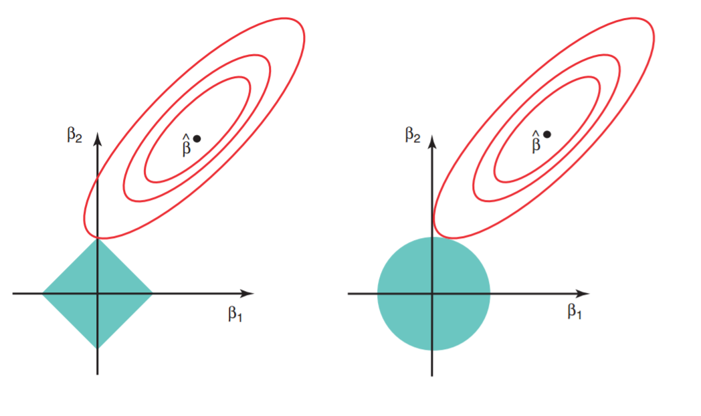

```{r setup, include=FALSE}
library(xtable)
options(xtable.comment = FALSE,
        xtable.table.placement="H")
knitr::opts_chunk$set(echo = FALSE, warning = FALSE, message = FALSE)

load("../data/ols-results.Rdata")
load("../data/ridge-results.Rdata")
load("../data/lasso-results.Rdata")
load("../data/pcr-results.Rdata")
load("../data/plsr-results.Rdata")
```

## Overview

- Linear Modeling Techniques:
    * shrinkage
    * dimensionality reduction
- Motivation:
    * less overfitting
    * lower variance (at cost of bias)
    * curse of dimensionality

## Ridge and Lasso: Shrinkage

- Ridge regression:
$$\sum_{i = 1}^{n}(y_{i} - \beta_{0} - \sum_{j = 1}^{p}\beta_{j}x_{ij})^{2} + \lambda \sum_{j=1}^p \beta_j^2$$

- Lasso regression:
$$\sum_{i = 1}^{n}(y_{i} - \beta_{0} - \sum_{j = 1}^{p}\beta_{j}x_{ij})^{2} + \lambda \sum_{j=1}^p |\beta_j|$$

- $\lambda$ controls the amount of penalty assigned to non-zero coefficients, encourage shrinkage

## Ridge vs. Lasso

Lasso encourages feature-_selection_, while ridge produces more non-zero coefficients. 

```{r, out.width = "500px", echo=FALSE, fig.align = "center", fig.cap = "From: An Introduction to Statistical Learning, by James et al"}

```

## PCR and PLSR: Dimensionality Reduction

Purpose: reduce number of predictors by creating new ones from linear combination of the original

- PCR: principal component regression
    * unsupervised
    * choose direction that captures most variance in predictors
- PLSR: partial least square regression
    * supervised
    * choose direction that captures most variance in predictors AND response variable

## Dataset {.smaller}
Given 400 bank customers and their personal information, try to predict _Balance_

- Income
- Limit
- Rating
- Cards
- Age
- Education
- Gender
- Student
- Married
- Ethnicity

http://www-bcf.usc.edu/~gareth/ISL/Credit.csv

## Model Results: Coefficients

```{r, results='asis'}
coeffs <- data.frame(ols.fit$coefficients)
coeffs <- transform(merge(coeffs, as.matrix(ridge.fit$beta), by = 0, all = TRUE),
                    row.names = Row.names, Row.names = NULL)
coeffs <- transform(merge(coeffs, as.matrix(lasso.fit$beta), by = 0, all = TRUE),
                    row.names = Row.names, Row.names = NULL)
coeffs <- transform(merge(coeffs, pcr.fit$coefficients[ , , pcr.best.ncomp],
                          by = 0, all = TRUE),
                    row.names = Row.names, Row.names = NULL)
coeffs <- transform(merge(coeffs, plsr.fit$coefficients[ , , plsr.best.ncomp],
                          by = 0, all = TRUE),
                    row.names = Row.names, Row.names = NULL)
names(coeffs) <- c("ols", "ridge", "lasso", "pcr", "plsr")
print(xtable(coeffs, digits = 3), type = "html")
```

## Model Results: Error
```{r, results = "asis"}
error.table <- data.frame(MSE=c(mean(ols.sum$residuals^2), ridge.error,
                                lasso.error, pcr.error, plsr.error))
rownames(error.table) <- c("ols   :", "ridge    :", "lasso    :", "pcr    :", "plsr    :")
print(xtable(error.table, digits = 4), type = "html")

```

\
OLS has the least test error, though they're all pretty close

## Conclusions:

- Explanation:
    * PCR retained all components
    * lack of colinearity
    * lack of overfitting
- Limitations:
    * only captures linear relationships
    * otherwise, use different models or do feature engineering
